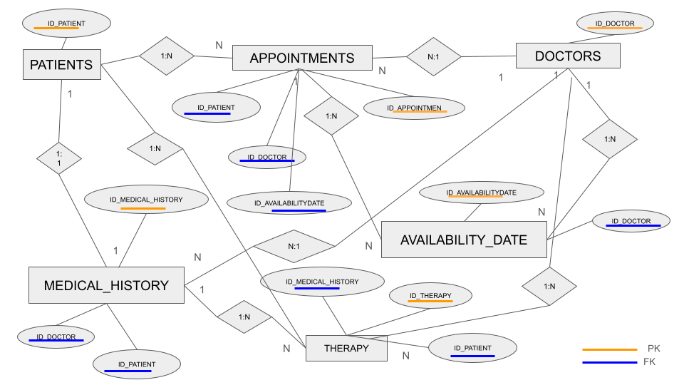

# Documentación

# Desafío de Diseño: Sistema de Gestión Medica 👩🏽‍⚕️💻

## Problema
Nuestro equipo de desarrollo está inmerso en la creación de un sistema de gestión para calendarizar turnos medicos, especializandose en turnos de terapia psicologica, pudiendo crecer para otras especialidades medicas dentro del centro medico. Nos enfrentamos al emocionante desafío de diseñar una base de datos eficiente que maneje de manera óptima todas las operaciones relacionadas con la información de pacientes, médicos, citas, historias médicas y terapias.

## Descripción del Problema
1. **Gestión Integral de Pacientes y Medicos**:
   Necesitamos una base de datos que permita registrar de manera detallada la información de los pacientes que ingresan al centro médico, así como del personal médico involucrado en el proceso. Es fundamental diferenciar entre las diversas especialidades médicas ofrecidas en el centro para una gestión integral y efectiva.

2. **Gestión de turnos medicos y Disponibilidad Óptima**:
   La base de datos debe permitirnos registrar la disponibilidad de turnos médicos según la especialidad del médico, gestionar el ingreso de los pacientes y mantener actualizado el estado de los turnos médicos (ocupado o disponible). Esto garantizará una asignación eficiente entre turnos, médicos especialistas y pacientes, evitando conflictos y mejorando la atención al paciente.

3. **Privacidad y confidencialidad**
    Es crucial que los recursos de la base de datos sean manipulados únicamente según los roles correspondientes, asegurando la privacidad y confidencialidad de los datos tanto de los pacientes como de los médicos especialistas. Se debe implementar una capa de seguridad robusta para proteger la integridad de la información confidencial.

4. **Registro Detallado de las Historias Medicas**:
   El sistema debe registrar minuciosamente cada ingreso de paciente, incluyendo la fecha y hora, datos personales del paciente, médicos especialistas que lo atendieron y el registro de terapias realizadas. Este nivel de detalle nos permitirá llevar un control preciso de la evolución de cada paciente y mejorar la calidad de la atención médica.

5. **Registro Detallado de las Terapias**:
    Es fundamental mantener un registro detallado de cada terapia realizada, su gestión y seguimiento en relación con el paciente. Esto permitirá una optimización de los recursos médicos, ayudando a los médicos especialistas a obtener conclusiones más acertadas para sus pacientes y mejorar la calidad de vida de estos últimos.

## Entidades Principales

1. **Pacientes:**
    Cada paciente tiene un: 
    IDúnico: number,
    nombre: string, 
    apellido: string, 
    fecha de nacimiento: date, 
    género: string, 
    dirección: string, 
    número de teléfono: number.
        **TABLA**
        patients(
        id_patient INT AUTO_INCREMENT PRIMARY KEY,
        first_name VARCHAR(100) NOT NULL,
        last_name VARCHAR(100) NOT NULL,
        email VARCHAR(100) UNIQUE NOT NULL,
        birth DATE,
        gender VARCHAR(10),
        address VARCHAR(255),
        phone VARCHAR(20))

2. **Médicos:**
    Cada médico tiene un:
    IDúnico: number, 
    nombre: string, 
    apellido: string, 
    especialidad: string, 
    número de teléfono: number,
    sala en la que consulta: number.
        **TABLA**
        doctors(
        id_doctor INT AUTO_INCREMENT PRIMARY KEY,
        first_name VARCHAR(100) NOT NULL,
        last_name VARCHAR(100) NOT NULL,
        email VARCHAR(100) UNIQUE NOT NULL,
        speciality VARCHAR(100),
        phone VARCHAR(20),
        room VARCHAR(100))

3. **Citas:**
    Las citas están asociadas: 
    IDunico: number,
    IDpaciente : number, 
    IDmédico específicos : number, 
    fecha de la cita: date, 
    hora de la cita: date.
        **TABLA**
        appointments(
        id_appointment INT AUTO_INCREMENT PRIMARY KEY,
        id_patient INT,
        id_doctor INT,
        appointment_date DATE NOT NULL,
        appointment_time TIME NOT NULL,
        status ENUM('Pending', 'Confirmed', 'Cancelled', 'Completed') DEFAULT 'Pending')
    
4. **Disponibilidad de Médicos:**
    Registra la disponibilidad de los médicos para citas.
    Incluye:
    IDunico: number, 
    IDdoctor: number, 
    fecha disponible: date, 
    hora disponible: date,
    estado: string,
    comentarios: string.
        **TABLA**
        availabilityDate (
        id_availability_date INT AUTO_INCREMENT PRIMARY KEY,
        id_doctor INT,
        availability_date DATE NOT NULL,
        availability_time_from TIME NOT NULL,
        availability_time_to TIME NOT NULL,
        status ENUM('Available', 'Booked', 'Cancelled') DEFAULT 'Available',
        comment VARCHAR(255)
        )

5. **Historias Médicas:**
    Cada historial médico tiene un:
    IDúnico: number,  
    IDpaciente: number, 
    IDmédico: number,  
    fecha de concurrencia: date, 
    detalles de la visita: string, 
    diagnóstico: string,
    tratamiento: string.
        **TABLA**
        medical_history (
        id_history INT AUTO_INCREMENT PRIMARY KEY,
        id_patient INT,
        id_doctor INT,
        concurrence_date TIMESTAMP DEFAULT CURRENT_TIMESTAMP,
        details TEXT,
        diagnosis TEXT,
        treatment TEXT
        )

6. **Terapias:**
    Las terapias están asociadas A:
    IDunico: number,
    IDpaciente: number, 
    IDmédico: number,
    fecha de sesión: date, 
    detalles de la sesión: string, 
    progreso: string,
    observaciones: string.
        **TABLA**
        therapy(
        id_session BINARY(16) PRIMARY KEY DEFAULT (UUID_TO_BIN(UUID())),
        id_patient INT,
        id_doctor INT,
        session_date DATE,
        details TEXT,
        progress TEXT,
        obs TEXT
        )

## Objetivo
* El objetivo principal es crear una base de datos que permita a un centro médico gestionar de manera efectiva la información de pacientes, médicos, citas, historias médicas y terapias. Esta base de datos debe ser fácil de mantener, escalable y garantizar la integridad de los datos, permitiendo así una gestión ágil y precisa de todas las operaciones médicas.

## Diagrama Entidad Relación

## Population ##

**For Windows CMD**
(Requisitos 
    Tener mysql como variable de entorno
    El archivo csv debe estar alojado en la carpeta Uploads de Mysql
    Por lo general la carpeta se encuentra en la siguiente ruta:
    C:\ProgramData\MySQL\MySQL Server 8.0\Uploads)

- Abrir CDM(teclas: windows+R, enter)
- Escribir 
    mysql ( de esta manera levanta el servidor de mysql)
- Escribir 
    mysql -u root -p --host 127.0.0.1 --port 3306 --local-infile=1 
- Introducir password
- Escribir
    SHOW GLOBAL VARIABLES LIKE 'local_infile'
- El cuadro que retorna , local_infile debe estar en ON
- En caso de que este en OFF , escribir 
    SET GLOBAL local_infile - 'ON'
- Volver a mostrar las variables escribiendo
    SHOW GLOBAL VARIABLES LIKE 'local_infile' (esta debe estar en ON)
- Para insertar data en el CMD de Windows escribir:
    load data infile 'C:\\ProgramData\\MySQL server 8.0\\Uploads\\TU_NOMBRE_DE_ARCHIVO.csv' into table TU_DB.TU_TABLA_A_INSERTAR_DATOS fields terminated by ',' lines terminated by '\n' ignore 1 rows;

## Documentación de Vistas de Base de Datos
**Vista: citas_por_estado**
* Descripción: Esta vista muestra la cantidad de citas agrupadas por estado en la tabla de citas.
* Columnas:
 - status: Estado de la cita.
 - cantidad_citas: Cantidad de citas con ese estado.

**Ejemplo de consulta:**
SELECT * FROM citas_por_estado;

**Vista: historial_medico_por_paciente**
####  Descripción: Muestra el historial médico de los pacientes, incluyendo detalles, diagnósticos y tratamientos.
####  Columnas:
*  first_name: Nombre del paciente.
*  last_name: Apellido del paciente.
*  details: Detalles del historial médico.
*  diagnosis: Diagnóstico del historial médico.
*  treatment: Tratamiento del historial médico.

**Ejemplo de consulta:**
SELECT * FROM historial_medico_por_paciente;

**Vista: sesiones_terapia_por_paciente**
####  Descripción: 
* Proporciona información sobre las sesiones de terapia de los pacientes, incluyendo detalles, progreso y observaciones.
####  Columnas:
 * first_name: Nombre del paciente.
 * last_name: Apellido del paciente.
 * details: Detalles de la sesión de terapia.
 * progress: Progreso de la sesión de terapia.
 * obs: Observaciones de la sesión de terapia.

**Ejemplo de consulta:**
SELECT * FROM sesiones_terapia_por_paciente;

**Vista: disponibilidad_doctores**
####  Descripción: 
* Muestra la disponibilidad de los doctores en diferentes fechas y horarios.
####  Columnas:
 * first_name: Nombre del doctor.
 * last_name: Apellido del doctor.
 * availability_date: Fecha de disponibilidad.
 * availability_time_from: Hora de inicio de disponibilidad.
 * availability_time_to: Hora de fin de disponibilidad.

 **Ejemplo de consulta:**
SELECT * FROM disponibilidad_doctores;

**Vista: frecuencia_diagnosticos**
####  Descripción: 
* Proporciona estadísticas sobre la frecuencia de diagnósticos realizados por especialidad de doctor.
####  Columnas:
 * speciality: Especialidad del doctor.
 * diagnosis: Diagnóstico realizado.
 * cantidad_diagnosticos: Cantidad de veces que se realizó ese diagnóstico para esa especialidad.

**Ejemplo de consulta:**
SELECT * FROM frecuencia_diagnosticos;

## Documentación de Funciones
**Función: CalculateTotalTherapyHoursByPatient**
####  Descripción:
* Calcula la cantidad total de horas de terapia que ha tenido un paciente específico y devuelve este valor en un formato legible con unidades de horas.

####  Parámetros de entrada:
* p_id_patient

####  Retorno: 
* VARCHAR(20) . Cantidad total de horas en terapia.

**Función: CalculateTotalAppointmentHoursByPatient**
#### Descripción: 
* Calcula la cantidad total de horas de las citas confirmadas que ha tenido un paciente específico y devuelve este valor en un formato legible con unidades de horas.

#### Parámetros de entrada:
 * p_id_patient

#### Retorno: 
 * VARCHAR(20) . Cantidad total de horas de las citas confirmadas.

**Función: AddAvailableDays**
#### Descripción: 
* Permite agregar días disponibles en la tabla availabilityDate para un doctor específico en un rango de fechas determinado, con un intervalo de días establecido.

#### Parámetros de entrada:
* p_id_doctor
* p_start_date
* p_end_date
* p_interval

#### Retorno:
* VARCHAR(20) . Horarios disponiles de los doctores 

## Documentación de Procedimientos Almacenados
**Procedimiento: ScheduleAppointment**

#### Descripción: 
* El procedimiento almacenado ScheduleAppointment se encarga de programar una cita verificando la disponibilidad del doctor en la fecha y hora especificadas, y luego actualiza el estado de la cita y la disponibilidad en la base de datos.

#### Parámetros:
* p_id_doctor INT,
* p_appointment_date DATE,
* p_appointment_time TIME,
* p_start_hour TIME,
* p_end_hour TIME,
* p_id_patient INT

#### Retorno:
* Mensaje de éxito o error

#### Ejemplo de uso:
* CALL ScheduleAppointment(1, '2024-04-24', '10:00:00', '09:30:00', '11:00:00', 1);

## Documentación de Triggers
**Trigger: before_insert_patient_email_check**

#### Descripción: 
* Este trigger se activa antes de insertar un nuevo paciente en la tabla de pacientes. Su función es verificar si el correo electrónico del nuevo paciente ya está registrado en la base de datos. Si se encuentra un paciente con el mismo correo electrónico, el trigger devuelve un error, impidiendo la inserción del nuevo paciente con el mismo correo electrónico.

#### Detalles:

* Tabla afectada: PATIENTS
* Acción: INSERT
* Información registrada: Email

#### Ejemplo:

 * Se inserta un nuevo email.
 * El trigger verifica si existe o no el email, pasa a registrarse en patiens cuando no se encuentra registrado.

**Trigger: UpdateAvailabilityOnDeleteAppointment**

#### Descripción: 
* Este trigger se activa antes de eliminar una cita de la tabla "appointments". Su propósito es actualizar el estado de disponibilidad en la tabla "availabilityDate" si la cita que se está eliminando estaba previamente confirmada.

#### Detalles:
* Tabla afectada: AVAILABILITYDATE
* Acción: DELETE
* Información registrada: Estado de la cita

#### Ejemplo:
* Se elimina una cita confirmada.
* El trigger cambia el estado de disponibilidad correspondiente en la tabla "availabilityDate" de vuelta a "Disponible", permitiendo que ese intervalo de tiempo esté disponible nuevamente para futuras citas.

## Como levantar el proyecto en CodeSpaces GitHub
* env: Archivo con contraseñas y data secretas
* Makefile: Abstracción de creacción del proyecto
* docker-compose.yml: Permite generar las bases de datos en forma de contenedores

#### Pasos para arrancar el proyecto
* En la terminal de linux escribir :
    - `make` _si te da un error de que no conexion al socket, volver al correr el comando `make`_
    - `make clean-db` limpiar la base de datos
    - `make test-db` para mirar los datos de cada tabla
    - `make backup-db` para realizar un backup de mi base de datos
    - `make access-db` para acceder a la base de datos
